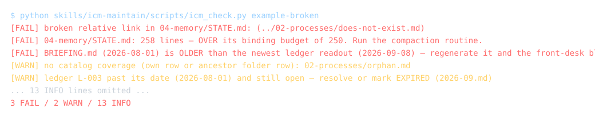

# icm-ops — skills that keep an ICM workspace honest

**For Claude Code, Codex, Cursor, and any agent that reads the Agent Skills format: a ledger that scores the agent's advice, a verifier that checks its work before it reports "done", and a maintenance run that keeps the files true.**

You built the workspace with [icm-architect](https://github.com/RinDig/icm-architect), or by hand from the [ICM paper](https://arxiv.org/abs/2603.16021). This is the layer that runs it afterwards, when the sessions that follow start trusting files that have quietly gone stale, reporting work that never landed on disk, and giving confident advice that nobody ever scores.

Written to the Agent Skills format, which Claude Code, Codex, Cursor, Gemini CLI, GitHub Copilot, OpenCode, Goose, Amp, Roo Code, JetBrains Junie, OpenHands, Letta and the rest of the [agentskills.io client list](https://agentskills.io) read (list as read on 2026-09-08). Exercised here with Claude Code and the `skills` CLI; reports from other harnesses are welcome. Three folders of markdown and one Python script. No runtime dependencies, no telemetry, MIT.

## Install

The route that needs nothing — no CLI, no network, no account: copy the three folders under `skills/` into wherever your agent reads skills.

```bash
cp -r skills/* ~/.claude/skills/     # Claude Code, user-level
cp -r skills/* .claude/skills/       # Claude Code, this project
cp -r skills/* .agents/skills/       # Codex, Cursor, OpenCode and other readers of .agents/skills/
```

This needs a file copy and, for the checker, any Python 3.8 or newer. `python3` on macOS and Linux; `python` or `py` on Windows.

Two conveniences, each dated because each may change while the copy route will not:

```bash
npx skills add xnfinite/icm-ops
```

As observed on 2026-09-08, the `skills` CLI puts a canonical copy in `.agents/skills/` and symlinks it into each detected agent's folder (`.claude/skills/` for Claude Code); `-g` installs at user level. It may change; the copy route will not.

```
/plugin marketplace add xnfinite/icm-ops
/plugin install icm-ops@icm-ops
```

Those are the Claude Code plugin commands as of 2026-09-08. They may change; the copy route will not.

## The checker, at the moment of the write (Claude Code only)

`icm_check.py` knows every rule in this pack. What it cannot choose is *when* it
runs: a session finds out what it broke at the next maintenance pass, by which
time a one-line fix has become a compaction, and a binding budget crossed on the
third write of a session is discovered on the thirtieth.

The pack ships a **mod** — a plugin whose code runs inside Claude Code — that
runs the shipped checker after a write inside a workspace and says only what
changed. It is installed by the plugin route above; nothing else to do.

It speaks when a write introduces a FAIL, and once more when the last one
clears. Steady state is silent, because a signal that fires every turn stops
being read — the same failure as a build light that is always red.

**It reports to the agent, not to you.** A workspace is written by the agent
walking it; you are not the one who can act on "this write crossed a budget".
So the finding rides on the tool result's `context` — read by the model,
never shown to you — rather than a notification about something you did not
do. A standing FAIL count appears in the status line, which you can glance at
or ignore.

It writes nothing, and it never blocks a write. A rule is a reason to think, not
a reason to refuse an edit, and the checker stays the authority: the mod runs
`skills/icm-maintain/scripts/icm_check.py --json` and reports it. There is no
second checker and no restated rule, because a budget owned in two places is how
an off-by-one reaches a binding threshold.

The other install routes copy skills only; a mod needs the plugin route. The
checker itself runs anywhere Python 3.8 does, with or without it.

### probe-first: the ledger, enforced instead of read

A ledger scores advice and a readout turns the record into a briefing the next
session reads on arrival. Across the ledgers this pack has seen, one failure
dominates the working sessions: **a numeral or an absolute put on a shipping
surface without the one-step-away check.** Count or probe first, then write the
sentence.

The trouble with a briefing is that it is read at the start and skipped under
momentum. One session, in the same hour it had re-read its own, wrote "only
three preview clips exist" where there were fifty, "it is not the files" after
checking one of five, and took an empty accessibility tree as proof that an
application had wedged. Advice a session can skim past is not a control.

`probe-first` watches the agent's own replies. When one states an absolute and
**nothing was run that turn that could have checked it**, the mod appends a row
the agent reads and the person never sees, naming the phrase and asking for the
one command that would settle it.

It is deliberately **procedural, not factual**. The same briefings warn that
self-consistent systems only prove their pipes: a model grading its own claim
over its own transcript inherits the context that produced the claim, so it
cannot sort a wrong absolute from a right one. It can answer "did anything run?"
— and that is the step that gets skipped. So the mod never says you are wrong,
only that you did not look.

A hedged sentence passes, because a claim marked unverified is already honest.
One nudge per turn at most. It never blocks and never edits what was said.

Install it on its own; it is independent of the checker mod:

```
/plugin install probe-first@icm-ops
```

Read what it does before you trust it, as with any mod:

```bash
claude plugin validate .
```

The `hooks:` and `calls:` lines name every event it handles and everything it
asks the harness to do: `tool.call` on Write, Edit and NotebookEdit, calling
`$.fs.exists`, `$.process.run`, `$.ui.toast` and `$.ui.status`. A mod runs with
your permissions and is not sandboxed.

Then run the checker on your workspace once, so you know where you stand:

```bash
python3 .claude/skills/icm-maintain/scripts/icm_check.py .      # project install
python3 ~/.claude/skills/icm-maintain/scripts/icm_check.py .    # user-level install
```

## What it looks like when it is working

This is the block (abridged) the ledger writes into the front desk of one real workspace, regenerated from its own readouts. Every session that opens the workspace reads it first:

> **Know thyself.** You have a track record here, and it is not clean. As of the 2026-08-25 readout (n=19):
>
> - **Working sessions** reliably fail one way: numerals and absolutes on shipping surfaces, asserted without the one-step-away check (5 of 5 failures). Count or probe FIRST, then write the sentence.
> - **Reviewing sessions** fail two ways: verdicts about state past their instruments (three times — read what your tool says it does NOT cover before reporting absence), and closure carried past its evidence — the costliest error in the book was nine verified-true searches and a wrong "channel is dead." Before declaring anything dead or absent: name the frame your search inherited, run one search that abandons it.

Nobody wrote that by hand. It is what nine days of logged calls (2026-08-17 to 2026-08-25 inclusive, 19 entries), attached outcomes, and one readout produced; the record has since run three weeks. The outcomes were attached by the same operator who made the calls, so it is a self-scored record; that is why the falsifier is written before the call, not after.

## The three skills

| Skill | The rule it enforces | What it gives the next session |
|---|---|---|
| **icm-ledger** | No consequential recommendation without a falsifier, logged *before* the advice is given. Outcomes attach when reality shows up. | A monthly ledger, cost-weighted readouts, and the "Know thyself" block above. |
| **icm-verifier** | A claim is not reportable until verified by observation at the point where it will be consumed. | The eight faces of a false "done", the drills that defeat them, a report grammar, and audit mode for other sessions' reports. |
| **icm-maintain** | Files carry binding budgets; over budget fails the build; compaction moves, never deletes. | `icm_check.py`, the compaction routine, and a scheduled maintenance run with explicit "authorized to fix" and "never" lists. |

### icm-ledger — score the advice, not just the work

Every entry is written so it can lose:

```
## L-036 · 2026-09-02 · builder
CLAIM: The public headline saving is the schema-deferred upper
bound and overstates what the library delivers on a standard host …
CONFIDENCE: high — the arithmetic reproduces from existing exports.
FALSIFIER: the spec lets a host omit inputSchema as a normal mode; or an
independent re-derivation disagrees by more than rounding.
COST: relationship — a public number gets much smaller.
REVIEW-BY: 2026-09-09
OUTCOME: CONFIRMED-IN-SCOPE 2026-09-03 — tested against the spec; …
```

Outcomes are one of `CONFIRMED`, `CONFIRMED-IN-SCOPE`, `DISPROVEN`, `MIXED`, `AVERTED`, `EXPIRED`, `MOOT` (the question dissolved before the falsifier could fire); the grammar is in [FORMAT.md](FORMAT.md#ledger-entries). A readout counts them by adviser and by cost class and writes the sentence that matters ("reliable most of the time, and wrong about the expensive ones"). Disagreements between advisers, or between an adviser and the owner, are logged as D-entries. Wrong calls are never deleted; they are the asset.

### icm-verifier — the eight faces of a false "done"

Container work that never hit disk. The short-circuited check that printed a clean result from a step that never ran. Verified in the wrong place: right artifact, wrong size, crop, or copy. The false negative after one guessed directory, or a search blind to a letterspaced wordmark. The numeral read as a label, and the agreeable number nobody counted. Self-reported verification with no observation named. Premature closure: true premises, wrong conclusion, nine honest searches and a wrong "channel is dead." The closed loop: a check that shares its source with the claim it checks. Nine drills cover the eight faces; seven faces were caught after they got past a review, the eighth was designed before it could. The report grammar is two sentences: "Done, verified by [observation]" or "Done, unverified." Never a bare done.

### icm-maintain — the workspace fixes its own errors



```
$ python skills/icm-maintain/scripts/icm_check.py example-broken --today 2026-09-08
[FAIL] broken relative link in 04-memory/STATE.md: (../02-processes/does-not-exist.md)
[FAIL] 04-memory/STATE.md: 258 lines — OVER its binding budget of 250. Run the compaction routine.
[FAIL] BRIEFING.md (readout: 2026-08-01) is OLDER than the newest ledger readout (2026-09-08) — regenerate it and the front-desk block
[WARN] no catalog coverage (own row or ancestor folder row): 02-processes/orphan.md
[WARN] ledger L-003 past its date (2026-08-01) and still open — resolve or mark EXPIRED (2026-09.md)
... 14 INFO lines omitted ...
3 FAIL / 2 WARN / 14 INFO
```

`--today` pins the clock so this block re-derives on any day; without it the WARN count grows as the fixture's review dates pass.

Budgets bind (over = FAIL, and the checker never raises one). Compaction is the one subtractive operation and it is staged for a human, never applied unattended. A scheduled maintenance session (daily or weekly) runs the checker, fixes only what the "authorized" list allows, backs up the protected files only after a clean run, and logs one line, because the immune system must not become the disease. Configure paths and budgets in an optional `icm-ops.json` at the workspace root; the defaults are the ICM conventions.

## With and without

| An ICM workspace… | without icm-ops | with icm-ops |
|---|---|---|
| Advice the agent gave last week | gone with the session | logged with a falsifier, scored when reality arrives |
| "Done" from a parallel session | taken on faith | audited claim by claim at the consumption point |
| STATE.md left alone | 273 lines one week after a 232-line trim (one operator, measured 2026-08-25) | 250 by rule, compacted by a routine with receipts |
| A stale number in a hot file | trusted | stamped `checked: date · source · stale after: N days`, flagged when blown |
| What the next session knows about its own failure modes | nothing | the "Know thyself" block, regenerated from readouts |

## Numbers — one operator's record, not a benchmark

Three weeks (2026-08-17 → 2026-09-08), one workspace, two advisers (a working session and a reviewing session), 43 ledger entries and 3 disagreement entries. Eighteen carry an outcome word from the vocabulary above: 7 disproven, 4 confirmed, 2 confirmed in scope only, 3 mixed, 1 averted, 1 moot. The 2026-08-25 readout — n=19 entries logged by that date, open ones included — found the working session's five disproven calls were all one failure class, which is how the block above got written. That is the whole point: the number that matters was not the accuracy rate, it was the *shape* of the errors, and no one could see it until they were logged.

Counted from that operator's ledger on 2026-09-08; the ledger itself is private. These are one person's calls in one workspace. They say nothing about your agent until you log yours.

## Try it on the example

```bash
git clone https://github.com/xnfinite/icm-ops
cd icm-ops
python scripts/test.py                                                              # spec-valid skills, both examples, the banned-phrase sweep
python skills/icm-maintain/scripts/icm_check.py example --today 2026-09-08          # 0 FAIL
python skills/icm-maintain/scripts/icm_check.py example-broken --today 2026-09-08   # names the five seeded defects
```

`example/` is a complete minimal workspace: front desk, catalog, conventions, state, one decision, a six-entry ledger with a readout, a briefing, a maintenance log. Copy it to start, or point the checker at the workspace you already have. `--today` pins the clock to the fixtures' date; drop it to watch the checker judge them against today.

## Your first week

1. Run the checker on your workspace (the installed form above) and read its header line: that line is the clock every date in the report is judged against.
2. Create `04-memory/ledger/<YYYY-MM>.md` from `skills/icm-ledger/assets/ledger-month-template.md` and give it a catalog row.
3. Paste the no-readout block from `skills/icm-ledger/assets/front-desk-block.md` into `CLAUDE.md` and `AGENTS.md`.
4. Log each consequential recommendation before giving it: claim, confidence, falsifier, cost, review-by.
5. After roughly ten entries with outcomes, write the readout per `skills/icm-ledger/assets/readout-template.md` and regenerate `BRIEFING.md` from `skills/icm-ledger/assets/briefing-template.md`.
6. Schedule the checker: `skills/icm-maintain/references/scheduling.md` has a cron line, a `schtasks` command, and a session-start hook.

## What it does not do

- It does not build a workspace. That is [icm-architect](https://github.com/RinDig/icm-architect), by the method's authors.
- It does not make an agent correct. It makes claims checkable and advice scorable; the agent can still be wrong, and now you find out.
- It is not a safety or security product and makes no such claims.
- The ledger only works if someone attaches outcomes. A ledger nobody scores is a diary.

## Support, stability, continuity

- Runs on Python 3.8 and newer, standard library only, on Windows, macOS and Linux; the checker reads files with CRLF or LF line endings.
- The formats, and the surfaces you may build on, are specified in [FORMAT.md](FORMAT.md#scope-and-stability). How versions move and how to contribute are in [CONTRIBUTING.md](CONTRIBUTING.md).
- Report a problem per [SECURITY.md](SECURITY.md), or open an issue at https://github.com/xnfinite/icm-ops/issues.
- Continuity: MIT, no central service, nothing phones home. The copy-a-folder route needs neither the maintainer nor any registry; if this repository goes quiet, fork it and keep going. The maintainer is Nightflow Systems (GitHub account xnfinite).

## Credits

ICM — Interpretable Context Methodology: Folder Structure as Agentic Architecture — is [Jake Van Clief and David McDermott's](https://arxiv.org/abs/2603.16021); the [official repo](https://github.com/RinDig/Interpretable-Context-Methodology) and [icm-architect](https://github.com/RinDig/icm-architect) are theirs. icm-ops is the operating layer one practitioner built on top of it and used over three weeks (2026-08-17 → 2026-09-08) before packaging it.

If it saves you one bad call, star the repo. If you want it installed and tuned in your own workspace, the maintainer does that as a service; open an issue at https://github.com/xnfinite/icm-ops/issues.

MIT © Nightflow Systems (github.com/xnfinite)
